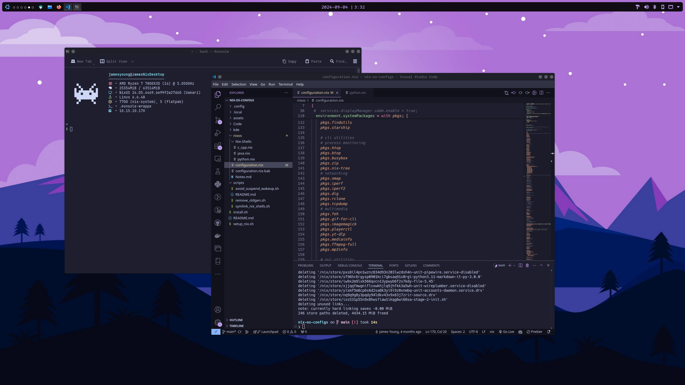
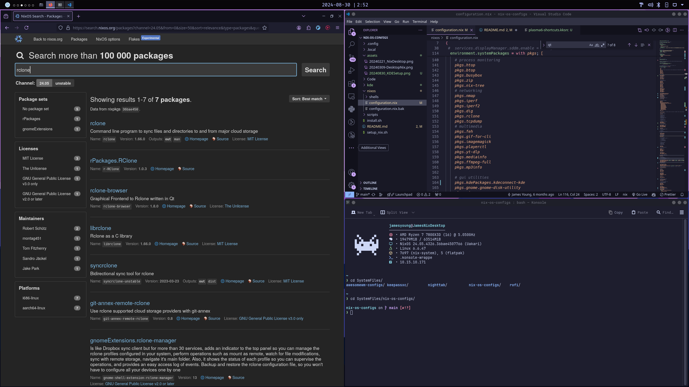
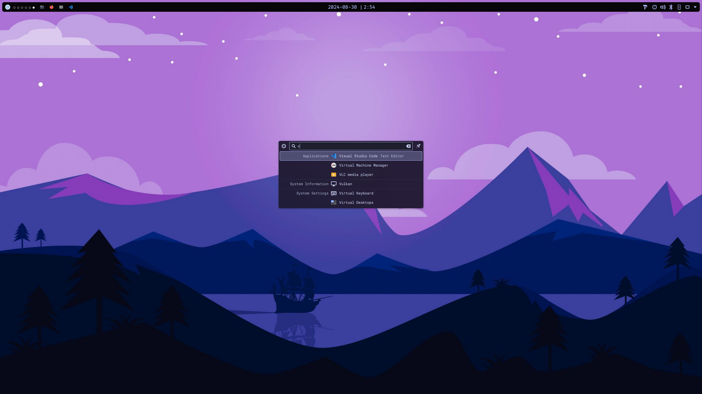

# My NixOS Configs

My laptop (Framework 13) config files using NixOS.

## Preview

## System Info

- OS: [NixOS](https://nixos.org/)
- Desktop Environment: [KDE Plamsa 6](https://nixos.wiki/wiki/KDE)
- Diplay Manager: LightDM
- Shell: Bash
- Terminal: [Konsole](https://konsole.kde.org/)
- Tiling: [Krohnkite](https://github.com/anametologin/krohnkite)
- Theme:
  - Global Theme: Breeze Dark
  - Colors: [Catppucin Mocha Lavender](https://github.com/catppuccin/kde)
  - Window Decoration: [Dracula](https://draculatheme.com/)
  - Icons: [Papirus Dark](https://github.com/vinceliuice/Tela-icon-theme)
  - Cursors: [Dracula Cursors](https://draculatheme.com/)
  - Wallpaper: See [here](./assets/PurpleMountain-Wallpaper.jpg)
- KDE Panel Widgets (left to right):
  - [Application Launcher](https://userbase.kde.org/Plasma_application_launchers)
  - [Desktop Indicator](https://store.kde.org/p/2131462)
  - [Icons-only Task Manager](https://userbase.kde.org/Plasma/Tasks/en)
  - [Digital Clock](https://userbase.kde.org/Plasma/Clocks/en)
  - [Panel Colorizer](https://store.kde.org/p/2130967)
  - [System Tray](https://userbase.kde.org/Plasma/SystemTray)
- Font: RobotoMono Nerd Font 10 pt

## Notes

### Setup

Replace default config file in `/etc/nixos/configuration.nix` using something like:  

`sudo cp ./nixos/configuration.nix /etc/nixos/configuration.nix`.

Or create symlink with something like:

`sudo ln -s ./nixos/configuration.nix /etc/nixos/configuration.nix`

Then apply changes by running rebuild and switch:

`sudo nixos-rebuild switch`

Once changes have been applied manually setup panel, theming, shortcuts, widgets. Optionally add Krohnkite for tiling support.

### Todo

- Organize config file better (can break down from one large file to smaller files)
- Consider making KDE settings (theming, shortcuts, etc) more automated (currently have to manually go into KDE settings to do so)

### My Application List

#### My Other Commonly Used Applications (GUI)

- Video Player: VLC, MPV
- Browsers: Firefox, Librewolf, Ungoogle Chromium
- Text-Editors: Kate, VIM, NVIM
- IDE: VSCode
- PDF Viewer: Okular
- Image Viewer: Gwenview
- Gaming
  - Launchers: Steam, Lutris
  - Emulators: Cemu (Wii), Yuzu (Switch RIP), Ryujinx (Switch RIP), Suyu (Switch)
- Graphics:
  - 3D: Blender
  - Photo Editing: GIMP
  - Video Editing: KdenLive
- ePub: Calibre
- Note-taking:
  - General: Joplin
  - Drawing: R-Note (stylus), Excalidraw
  - Diagrams: DrawIO, Excalidraw
- Printing: CUPS
- USB flashing: Balena Etcher
- Screenshot Utility: Spectacle

#### Some Extra CLI Applications I use

- neofetch (display system info)
- starship (bash prompt)
- tldr (simplify man pages)
- tmux (terminal multiplexer)
- htop (top but a little nicer)
- yt-dlp (CLI youtube audio/video downloader, super useful)
- neovim
- tree
