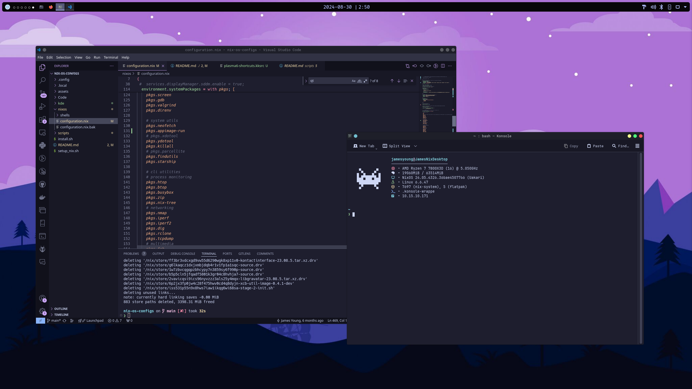

# My NixOS Configs

My desktop config files using NixOS.

## Preview




## System Info

- OS: [NixOS](https://nixos.org/)
- Desktop Environment: [KDE Plamsa 6](https://nixos.wiki/wiki/KDE)
- Shell: Bash
- Terminal: [Konsole](https://konsole.kde.org/)
- Tiling: [Krohnkite](https://github.com/anametologin/krohnkite)
- Theme:
  - Global Theme: Breeze Dark
  - Colors: Catppucin Mocha Lavender
  - Window Decoration: Dracula
  - Icons: Tela Dracula Dark
  - Cursors: Dracula Cursors
- KDE Panel Widgets (left to right):
  - Application Launcher
  - Desktop Indicator
  - Icons-only Task Manager
  - Digital Clock
  - Panel Colorizer
  - System Tray

## Notes

### Setup

Replace default config file in `/etc/nixos/configuration.nix` using something like:  

`sudo cp ./nixos/configuration.nix /etc/nixos/configuration.nix`.

Then apply changes by running rebuild and switch:

`sudo nixos-rebuild switch`

Once changes have been applied manually setup panel, theming, shortcuts, widgets

### Todo

- Organize config file better (can break down from one large file to smaller files)
- Consider making KDE settings (theming, shortcuts, etc) more automated (currently have to manually go into KDE settings to do so)

### Config Notes

Currently all dumped into one large config file.
  
Config file assumes have mounted drive and will be auto-mounted. Eg:

``` bash

fileSystems."/home/jamesyoung/Extra-Storage-01" = {
    device = "/dev/disk/by-label/JamesStorage";
    fsType = "ext4";
    options = [ "nofail" ];
  };

```

### My Application List

#### My Other Commonly Used Applications (GUI)

- Video Player: VLC, MPV
- Browsers: Librewolf, Ungoogle Chromium, Firefox
- Text-Editors: Kate, VIM, NVIM
- IDE: VSCode
- PDF Viewer: Okular
- Image Viewer: Gwenview
- Gaming
  - Launchers: Steam, Lutris
  - Emulators: Yuzu (RIP), Cemu (Wii), Ryujinx (Switch)
- Graphics:
  - 3D: Blender
  - Photo Editing: GIMP
  - Video Editing: KdenLive
- ePub: Calibre
- Note-taking:
  - General: Joplin
  - Drawing: R-Note (stylus), Excalidraw
  - Diagrams: DrawIO, Excalidraw
- Printing: CUPS
- USB flashing: Balena Etcher
- Screenshot Utility: Spectacle

#### Some Extra CLI Applications I use

- neofetch (display system info)
- tldr (simplify man pages)
- tmux (terminal multiplexer)
- htop (top but a little nicer)
- yt-dlp (CLI youtube audio/video downloader, super useful)
- neovim
- tree
