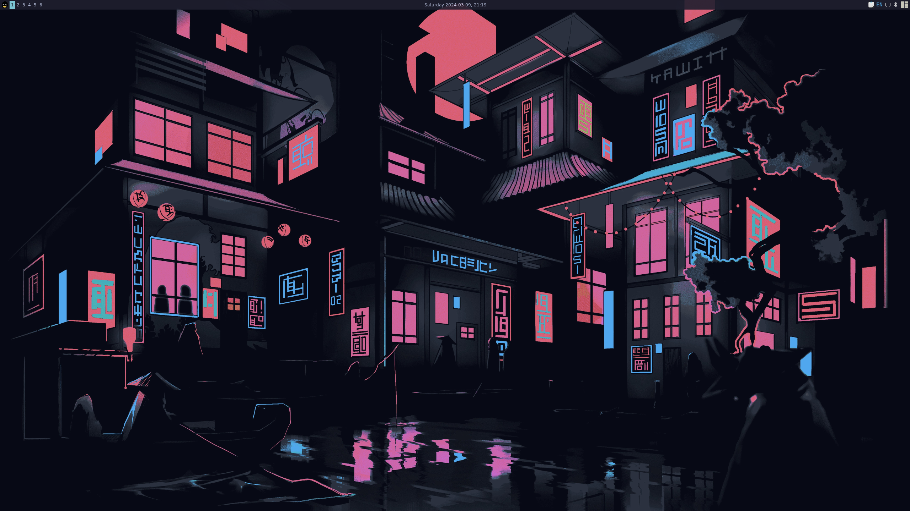

# My NixOS Configs
My desktop (and later laptop) config files. Ongoing transitioning from Arch + KDE (see old configs [here](https://github.com/jamesyoung-15/arch-kde-configs)) to NixOS + AwesomeWM.

## Preview

See workflow demo [here](#demo).

## System Info
- OS: [NixOS](https://nixos.org/)
- Window Manager: [AwesomeWM](https://awesomewm.org/)
- Shell: Bash
- Terminal: [kitty](https://github.com/kovidgoyal/kitty)
- Application Launcher: [Rofi](https://github.com/davatorium/rofi)
- File Manager: [Thundar](https://nixos.wiki/wiki/Thunar)
- Topbar: [Wibar](https://awesomewm.org/doc/api/classes/awful.wibar.html)
- GTK Themes: [Catppuccin GTK](https://github.com/catppuccin/gtk)
- QT Theme: [Catppuccin qt5ct](https://github.com/catppuccin/qt5ct)

## System Setup
The `awesome`, `qt5ct`, `rofi`, `kitty` directories also goes into `~/.config/`. The NixOS config `nixos/configuration.nix` goes in `/etc/nixos/configruation.nix`, but can also be changed.

## Demo

## Application List
### My Other Commonly Used Applications (GUI)
- GTK Themes Editing: lxappearance
- QT Themes Editing: KDE settings
- Video Player: VLC, MPV
- Browsers: Librewolf, Ungoogle Chromium
- Text-Editors: Kate, NVIM
- IDE: VSCode
- PDF Viewer: Okular
- Image Viewer: Gwenview
- Gaming
  - Launchers: Steam, Lutris
  - Emulators: Yuzu (Switch), Cemu (Wii)
- Graphics: 
  - 3D: Blender
  - Photo Editing: GIMP
  - Video Editing: KdenLive
- ePub: Calibre
- Note-taking:
  - General: Joplin
  - Drawing: R-Note (stylus), Excalidraw
  - Diagrams: DrawIO, Excalidraw
- Printing: CUPS
- USB flashing: Balena Etcher

### Some Extra CLI Applications I use
- tree
- neofetch (display system info)
- tldr (simplify man pages)
- tmux (terminal multiplexer)
- xdotool (automate key presses)
- htop (top but a little nicer)
- yt-dlp (CLI youtube audio/video downloader, super useful)
- neovim

## Next Steps
- Familiarize using Window Manager instead of DE (tiling, using keyboard more than mouse, etc.)
- Modularize NixOS config file instead of one large config file
- Improve AwesomeWM configs
  - Improve and style topbar
  - Maybe add bottom dock
  - Personalize behaviour more in general
